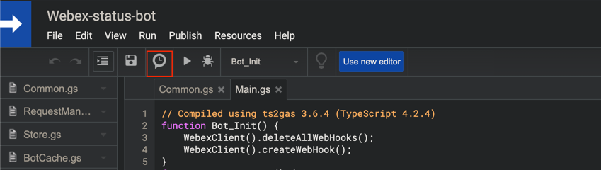

# Steps to deploy a new bot from sources

## Pre-requisites

* Register a new bot here: https://developer.webex.com/my-apps. You will need the bot name, bot email and token.

* nodejs
* typescript
* clasp: https://developers.google.com/apps-script/guides/clasp

1. Clone the repo
2. Run `npm install`

## Creating a project in Google Apps Script

1. Run `clasp login`
2. Run `clasp create --type standalone`
3. Edit the file `.clasp.json` by adding `filePushOrder`:
  ```json
  {
    "scriptId": "...",
    "filePushOrder": [
      "Common.ts",
      "RequestManager.ts",
      "Store.ts",
      "BotCache.ts",
      "Constants.ts",
      "Utils.ts"
    ]
  }
  ```
4. Run `clasp push`. Type `Yes` for `Manifest file has been updated. Do you want to push and overwrite?`
5. Run `clasp open` and open the project link in the browser.
6. In browser, open `Test.gs` file and run the `test` function to initialize a default config.
7. Now deploy the first version of the script: `Publish` -> `Deploy as webapp...` -> Click `Update`.
   Copy `Web app URL`, it's your `webAppHook` for the MainConfig.
8. In browser, open `File` -> `Project Properties` -> `Script Properties` and copy the content of property `Config`.
   This config has to be updated inline per your needs. For convenience, you can edit it in your favourite JSON editor
   and then save the new value. Default config example:
   ```json
   {"botName":"NotSpecified","botEmail":"NotSpecified","admins":["NotSpecified"],"botAuthToken":"NotSpecified","webAppHook":"NotSpecified","dailyReportTo":[],"managers":[],"dailyStatusRoomId":"NotSpecified","operationsRoomId":"NotSpecified","debugRoomId":"NotSpecified","helpPageUrl":"NotSpecified"}
   ```
   The initial required params are: `botName`, `botEmail`, `botAuthToken`, `webAppHook`.
   
   Suggestions:
   * Read js docs in [MainConfig.ts](MainConfig.ts)
9. Once you have all parameters filled in, open `Main.gs` file and run the `Bot_Init` function.
10. Create a "Debug Room" space in the Webex and invite the bot into the space.
    Send bot a message by mentioning it, to see the help, example: `@mybot help`.
    You need to initialize the debug room first, run, example: `@mybot init debug room`. This room will be used for Debug messages.
10. To see the other commands, send, example: `@mybot help`.

## Setting up triggers

To run functions, such as `Bot_AskStatuses`, `Bot_CheckStatuses`, on a regular basis, use the Google Apps Script triggers feature:


Some functions require additional permissions. Run a desired function manually to explicitly give it permissions (one time operation).

That's it!
